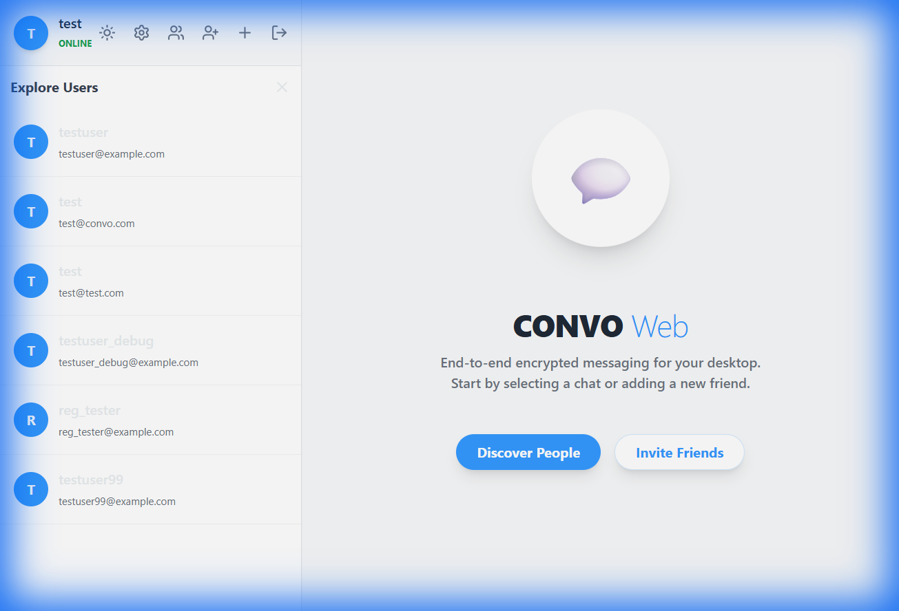
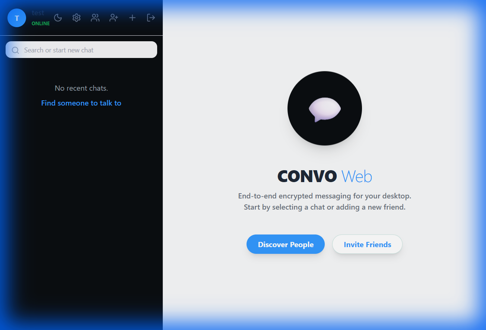
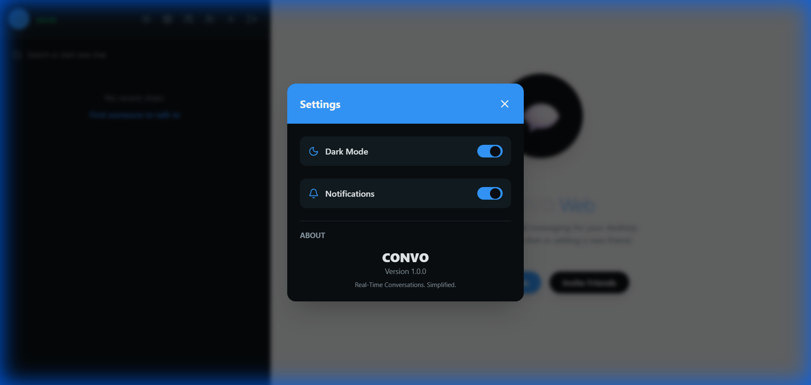
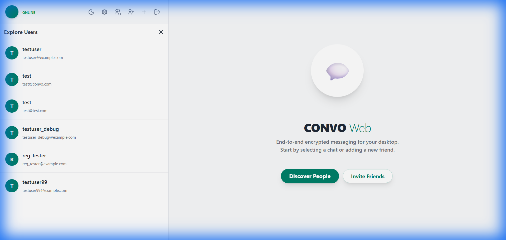
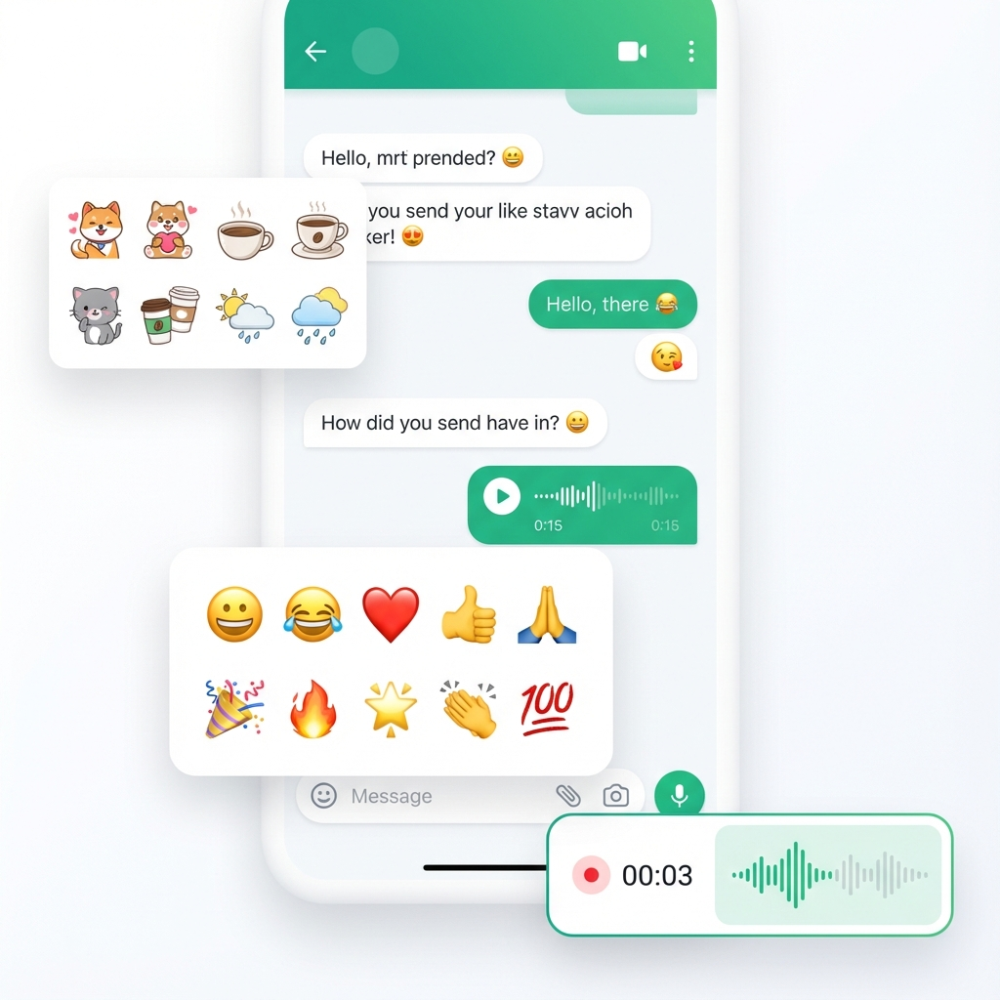

# 🏛️ KIROV DYNAMICS | CONVO CHAT (v2.0)

[](https://github.com/Raphasha27)


> **"Sovereign Communication for a Connected Future."**

## 🖼️ Visual Showcase


---
**CONVO** is a modern, feature-rich real-time chat application built with React and FastAPI. It provides a seamless messaging experience with advanced features like voice notes, emoji support, stickers, dark mode, and real-time notifications. Developed as a secure communication asset within the **Kirov Dynamics** ecosystem.

## ✨ Features

### 🎯 Core Features
- **Real-time Messaging** - Instant message delivery with WebSocket support
- **User Authentication** - Secure login and registration system
- **Private & Group Chats** - Support for one-on-one and group conversations
- **Online Status** - See who's online in real-time
- **Message Status** - Read receipts with checkmarks (✓ sent, ✓✓ read)
- **User Discovery** - Find and connect with new users

### 🎨 Advanced Features
- **🌙 Dark Mode** - Beautiful dark theme with smooth transitions
- **😀 Emoji Picker** - Quick access to 20+ popular emojis
- **🎨 Stickers** - Send fun stickers in conversations
- **🎤 Voice Messages** - Record and send voice notes
- **📎 File Attachments** - Share files and images
- **🔍 Message Search** - Search through conversation history
- **⚙️ Settings Panel** - Customize your experience
- **📸 Avatar Upload** - Personalize your profile with custom avatars
- **🔔 Notifications** - Browser notifications for new messages

## 🖼️ Screenshots

### Light Mode


### Dark Mode


### Settings Modal


### Discover Users


### Chat Features

*Showcasing: Emoji Picker, Stickers, and Voice Recording*

## 🛠️ Tech Stack

### Frontend
- **React 18** - Modern UI library
- **Vite** - Lightning-fast build tool
- **TailwindCSS** - Utility-first CSS framework
- **Axios** - HTTP client for API requests
- **Lucide React** - Beautiful icon library
- **WebSocket** - Real-time communication

### Backend
- **FastAPI** - High-performance Python web framework
- **SQLAlchemy** - SQL toolkit and ORM
- **PostgreSQL/SQLite** - Database options
- **Uvicorn** - ASGI server
- **JWT Authentication** - Secure token-based auth
- **Python-multipart** - File upload support

## 🚀 Getting Started

### Prerequisites
- Node.js (v16 or higher)
- Python (v3.8 or higher)
- PostgreSQL (optional, SQLite works too)

### Installation

1. **Clone the repository**
```bash
git clone https://github.com/Raphasha27/convo_chat.git
cd convo_chat
```

2. **Backend Setup**
```bash
cd backend

# Create virtual environment
python -m venv venv
source venv/bin/activate  # On Windows: venv\Scripts\activate

# Install dependencies
pip install -r requirements.txt

# Run the backend server
python -m uvicorn app.main:app --reload --host 0.0.0.0 --port 8000
```

3. **Frontend Setup**
```bash
cd frontend

# Install dependencies
npm install

# Run the development server
npm run dev -- --host 0.0.0.0 --port 5173
```

4. **Access the Application**
- Frontend: http://localhost:5173
- Backend API: http://localhost:8000
- API Docs: http://localhost:8000/docs

## 📁 Project Structure

```
convo_chat/
├── frontend/
│   ├── src/
│   │   ├── components/     # Reusable React components
│   │   ├── context/        # React context providers
│   │   ├── pages/          # Main application pages
│   │   ├── services/       # API service layer
│   │   └── index.css       # Global styles
│   └── package.json
│
├── backend/
│   ├── app/
│   │   ├── core/          # Core configuration
│   │   ├── models/        # SQLAlchemy models
│   │   ├── routes/        # API endpoints
│   │   ├── schemas/       # Pydantic schemas
│   │   └── main.py        # Application entry point
│   ├── uploads/           # User-uploaded files
│   └── requirements.txt
│
└── README.md
```

## 🔧 Configuration

### Backend Environment Variables
Create a `.env` file in the `backend` directory:

```env
DATABASE_URL=sqlite:///./convo.db
SECRET_KEY=your-secret-key-here
ALGORITHM=HS256
ACCESS_TOKEN_EXPIRE_MINUTES=30
```

### Frontend API Configuration
The frontend is configured to connect to `http://localhost:8000/api/v1`. To change this, edit `frontend/src/services/api.js`.

## 🤝 Contributing

Contributions are welcome! Please feel free to submit a Pull Request.

1. Fork the repository
2. Create your feature branch (`git checkout -b feature/AmazingFeature`)
3. Commit your changes (`git commit -m 'Add some AmazingFeature'`)
4. Push to the branch (`git push origin feature/AmazingFeature`)
5. Open a Pull Request

## 📝 License

This project is licensed under the MIT License - see the LICENSE file for details.

---
*Developed by Raphasha27 - Kirov Dynamics 2026.*

